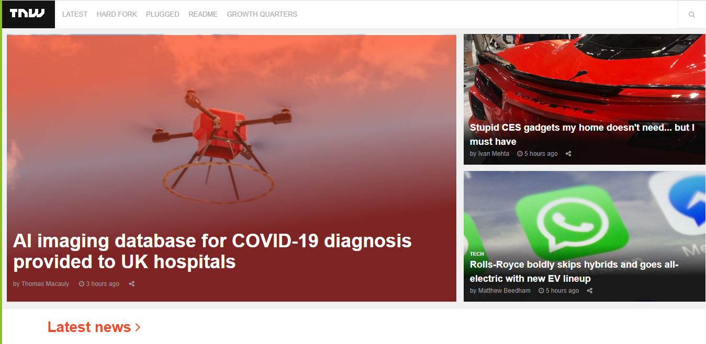

# Project No. 2: Responsive design

Microverse Project No. 2: Building a responsive website

> Building a responsive website using only HTML5 and CSS3 as part of The Odin Project Challenge. Displaying the use of FlexBox, Grid etc.

Additional description about the project and its features.

## Built With

- HTML5, CSS3
- No frameworks!

## Live Demo

[Live Demo Link](https://ey-charles.github.io/mv-02-responsive-design/)

## Authors

👤 ## Author 1 **Carlos Castillo**

- GitHub: [@ey-charles](https://github.com/ey-charles)
- Twitter: [@crloscstillo](https://twitter.com/crloscstillo)
- LinkedIn: [Carlos Castillo](https://www.linkedin.com/in/carlos-castillo-70430711a/)

👤 ## Author 2 **Hafed**

- GitHub: [@githubhandle](https://github.com/hafedefheij)
- Twitter: [@twitterhandle](https://twitter.com/hafedefheij)
- LinkedIn: [LinkedIn](https://www.linkedin.com/in/hafedefhej/)

## 🤝 Contributing

Contributions, issues, and feature requests are welcome!

Feel free to check the [issues page](issues/).

## Show your support

Give a ⭐️ if you like this project!

## Acknowledgments

- Hat tip to anyone whose code was used
- Inspiration
- etc

## 📝 License

This project is [MIT](lic.url) licensed.
